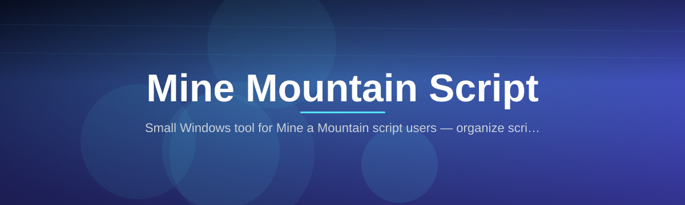
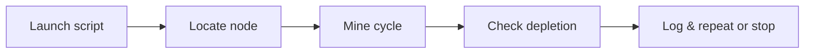

# mine-a-mountain-script-hub

*A no-nonsense Mine a Mountain Script for players who want mountain resources cleared out without babysitting a menu for hours.*

## What this is

**Mining a mountain by hand is a grind, so this script does the repetitive part for you.**

The full story

I started this project because I was tired of watching a progress bar for forty-five minutes while "mining" a mountain node in a game that treats mountains as glorified loot piles. Every existing tool I found was either abandoned, bundled with three other unrelated scripts, or asked for permissions a rock-breaking macro has no business needing. So I built one thing that does one job: run the Mine a Mountain Script, watch it work, close it when you're done. No accounts, no launcher, no telemetry dashboard. It's a solo project, updated when something breaks or a mountain layout changes, and it stays that way on purpose.

The mine-a-mountain-script-hub packages a single-purpose Mine a Mountain Script as a standalone Windows tool. It's built for the specific loop of approaching a mountain, mining through the layers, collecting the drops, and repeating — the part of the game most people don't want to do manually every session. There's no framework to learn and no config language to memorize; you set a couple of options and let it run in the background while you do something else.

The second half of the project is the maintenance behind it. Mountain mining logic tends to break the moment a game patch shifts drop tables, hitbox timing, or menu order. This repo tracks those changes so the script stays usable instead of quietly failing after an update — that's the actual value here, not the initial download.

  

The button above opens the project's landing page, where the current build of the Mine a Mountain Script is available to download.

## Who it is for

- **Players who mine mountains as a side task**, not the main point of their session
- **Resource stackers** who need a steady supply run without staring at the screen
- **Solo players on long-haul sessions** who want the grind automated while multitasking
- **People returning after a break** who don't want to relearn a clunky mining UI
- **Anyone who tried a bloated "all-in-one" script suite** and just wanted the mountain part

## What you can do

- **Run a full mining pass** on a mountain node from start to depletion without manual clicks
- **Set a target run count** so it stops after a defined number of cycles instead of running forever
- **Pause and resume** mid-run without losing track of progress
- **Adjust timing between actions** to match your game's current patch behavior
- **Auto-detect an empty node** and stop instead of grinding air
- **Log each run to a local text file** so you can see what happened after you step away
- **Toggle a lightweight overlay** showing current run count and elapsed time
- **Exit cleanly with one hotkey** at any point during a run

## Getting started

1. Open the [landing page](https://IndustrialIce65.github.io/mine-a-mountain-script-hub/) and download the current build.
2. Extract the download to any folder — no installer, nothing writes outside that folder.
3. Launch the `.exe` and confirm the Windows SmartScreen prompt (this is expected for unsigned indie tools).
4. Set your run count and timing in the small settings window, then hit Start.
5. Position your game window as instructed on first launch, then let the script take over.

## Requirements

- Windows 10 or Windows 11 (64-bit)
- No .NET, Java, or Python install needed — it's a standalone executable
- No build toolchain, no compiler, no admin rights required for normal use
- A little over 50 MB of free disk space
- The game running in windowed or borderless mode (fullscreen exclusive is not supported)

## How it works

1. The script reads the visible game window instead of injecting into the process.
2. It locates the mountain node using on-screen reference points you confirm on setup.
3. It executes the mine-approach-collect cycle at the timing you configured.
4. It checks for node depletion or your stop hotkey after every cycle.
5. It writes a short run log and exits when the target count is hit or you stop it.

## FAQ

**Is this a Mine a Mountain Script or a full game bot?**
Just the mining script. It handles the mountain node cycle only — it doesn't touch inventory, combat, or navigation elsewhere.

**Does the Mine a Mountain Script work on every mountain type in the game?**
It's tuned for standard rock/ore mountain nodes. Special event mountains with custom mechanics may need a settings tweak or aren't supported yet — check the FAQ section on the landing page for the current list.

**Will this get flagged by anti-cheat?**
It reads pixels and sends input like a human would, but no third-party tool is risk-free. Use it on accounts you're comfortable running automation on.

**Can I run it on Windows 11 without extra software?**
Yes, it's a standalone .exe. No runtime install is needed on either Windows 10 or 11.

**Why does Windows warn me when I open the download?**
Unsigned executables from independent developers always trigger SmartScreen. It's a warning about the lack of a paid certificate, not a detection of anything harmful.

## Troubleshooting

- **Script doesn't detect the mountain node** — Recalibrate the reference points in setup; a resolution or window-mode change usually breaks detection.
- **Cycles run too fast or miss actions** — Increase the timing delay slightly; some setups need more buffer between actions than others.
- **Overlay doesn't show up** — Toggle it off and on again in settings; it sometimes fails to render on the first launch after a Windows update.
- **Run count resets unexpectedly** — Make sure the log file isn't set to read-only; the script writes progress there between cycles.

## Changelog

**v2.6.0** — Reworked node-depletion detection after the last game patch changed the empty-node visual state; added the run log toggle.

**v2.5.2** — Fixed a timing drift issue that caused missed cycles on slower machines; overlay now shows elapsed time.

**v2.5.0** — Added pause/resume hotkey and a configurable target run count instead of manual stop only.

## License

Released under the [MIT License](LICENSE). This is an independent fan-made tool, provided as-is with no warranty — use it at your own discretion and in line with your game's terms of service.

  

